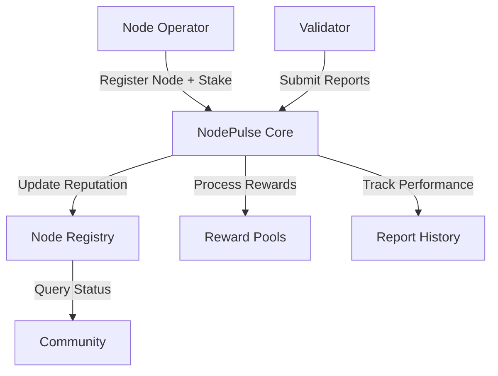

# NodePulse Monitoring System

A decentralized monitoring system for tracking and scoring Stacks blockchain nodes through community-driven performance validation.

## Overview

NodePulse enables transparent monitoring of Stacks blockchain infrastructure through a reputation-based scoring system. Node operators can register their nodes while validators submit performance reports to build a reliable measure of node quality and reliability.

### Key Features
- Decentralized node monitoring and reputation tracking
- Stake-based node registration
- Community-driven validation system
- Real-time performance metrics
- Automated reputation scoring
- Reward distribution for active participants

## Architecture

NodePulse uses a multi-stakeholder system where node operators and validators interact to create a reliable node reputation framework.



### Core Components
1. **Node Registry**: Tracks registered nodes, their metadata, and current reputation scores
2. **Validator System**: Manages validator registration and report submission
3. **Reputation Scoring**: Calculates weighted scores based on uptime, response time, and consensus participation
4. **Reward Distribution**: Handles staking and reward distribution for participants

## Contract Documentation

### NodePulse Core Contract

The main contract managing the entire NodePulse ecosystem.

#### Key Functions

##### Node Operations
- `register-node`: Register a new node with stake
- `unstake-node`: Initiate node withdrawal
- `complete-withdrawal`: Complete node unstaking after cooldown
- `update-node-url`: Update node URL
- `add-stake`: Add more stake to existing node

##### Validator Operations
- `register-validator`: Register as a validator
- `submit-report`: Submit node performance report

##### Administrative Functions
- `initialize`: Initialize contract parameters
- `set-admin`: Update contract administrator

## Getting Started

### Prerequisites
- Clarinet
- Stacks wallet with STX tokens for staking

### Node Registration

```clarity
(contract-call? .nodepulse-core register-node 
    "https://mynode.example.com" 
    u1  ;; NODE-TYPE-MINER
    u1000000)  ;; 1M uSTX stake
```

### Validator Registration

```clarity
(contract-call? .nodepulse-core register-validator)
```

### Submitting Reports

```clarity
(contract-call? .nodepulse-core submit-report 
    u1  ;; node-id
    u99  ;; uptime percentage
    u100  ;; response time (ms)
    u95)  ;; consensus participation percentage
```

## Function Reference

### Public Functions

| Function | Description | Parameters |
|----------|-------------|------------|
| `register-node` | Register new node | `url`, `node-type`, `stake-amount` |
| `register-validator` | Become validator | None |
| `submit-report` | Submit node report | `node-id`, `uptime`, `response-time`, `consensus-participation` |
| `unstake-node` | Begin unstaking | `node-id` |
| `complete-withdrawal` | Finish unstaking | `node-id` |

### Read-Only Functions

| Function | Description | Parameters |
|----------|-------------|------------|
| `get-node-info` | Get node details | `node-id` |
| `get-validator-info` | Get validator details | `address` |
| `get-node-report` | Get specific report | `node-id`, `validator`, `cycle` |

## Development

### Local Testing

1. Install Clarinet
2. Initialize test environment:
```bash
clarinet console
```

3. Run test commands:
```clarity
::advance_chain_tip 1
(contract-call? .nodepulse-core initialize tx-sender)
```

### Deployment

1. Deploy contract to testnet/mainnet
2. Initialize with administrator address
3. Configure minimum stake and other parameters

## Security Considerations

### Staking Requirements
- Minimum stake: 1M uSTX
- 7-day cooldown period for unstaking
- Stake slashing for malicious behavior

### Report Validation
- Minimum 6-hour interval between reports
- Metrics must be within valid ranges
- Multiple validators per node for accuracy

### Access Control
- Administrative functions restricted to contract owner
- Node operations limited to node owners
- Validator requirements must be met for reporting